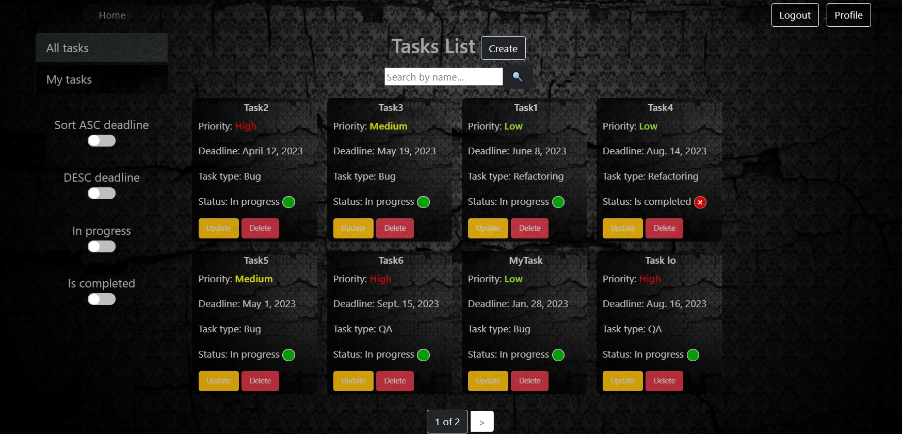

# Name of the project
A django task management project
## Check it out!
link
[Trello project deployed ](https://trello-5wky.onrender.com)

## Credential for testing:
username =  RomanS
password = 12121212@A
## Installing / Getting started

Python3 must be already installed

```shell
git clone https://github.com/AndereLion/Trello_analog
pip install -r  requirements.txt
python manage.py runserver
```
### Features

#Authentication functionality for WorkerUser (also create, update user-profile)
#Managing tasks (create,delete,update)
#Admin panel for managing 

### Demo

